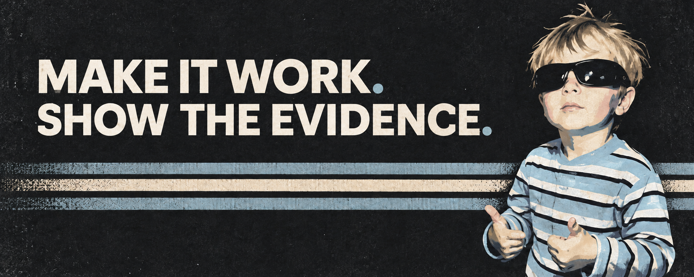

  

# Hi, I'm @JiayiLu2003.

I work on AI projects where a working demo is only the first step. I care about **baselines, failure cases, and honest evaluation**—then I turn the useful part into something people can run.

**Exploring** graph learning · recommendation systems · model evaluation · practical AI tools 
**Open to** algorithm, data science, and applied AI internships

## Two projects, one loop

**Make it work:** Trend2Video Pro turns a trend into a reviewable video package. **Show the evidence:** WorldCupROI turns mixed sports data into a decision prototype with baselines, uncertainty, and stated limits. Both follow the same loop: input → pipeline → inspectable output.

### 01 / Create · [Trend2Video Pro](https://github.com/JiayiLu2003/Trend2Video-Pro)

**Trend or URL → scoring and strategy → script and storyboard → MP4 publish package**

A local agent workflow that produces a video, subtitles, thumbnail, metadata, and quality report for manual review. The project includes a CLI, FastAPI endpoints, a Streamlit execution console, and SQLite trend memory.

[Watch the demo](https://github.com/JiayiLu2003/Trend2Video-Pro/blob/main/docs/assets/demo.gif) · [Inspect the pipeline](https://github.com/JiayiLu2003/Trend2Video-Pro#agent-pipeline) · [Run it locally](https://github.com/JiayiLu2003/Trend2Video-Pro#quick-start)

*Evidence boundary: the no-key demo uses mock LLM responses; its benchmark does not establish real-world content performance.*

### 02 / Decide · [WorldCupROI](https://github.com/JiayiLu2003/WorldCupROI)

**Historical matches + source text + commercial proxies → baselines and intervals → scenario dashboard**

A reproducible sponsorship analytics prototype that joins match context and attention signals, evaluates match and ROI-proxy baselines, and shows uncertainty and scenario comparisons in a dashboard.

[Open the dashboard](https://JiayiLu2003.github.io/WorldCupROI/) · [Read the case study](https://github.com/JiayiLu2003/WorldCupROI/blob/main/docs/portfolio_case_study.md) · [Check the data card](https://github.com/JiayiLu2003/WorldCupROI/blob/main/reports/data_card.md)

*Evidence boundary: sponsor spend, conversion, and ROI are constructed demo variables. Proxy-model scores do not validate real commercial return or campaign lift.*
